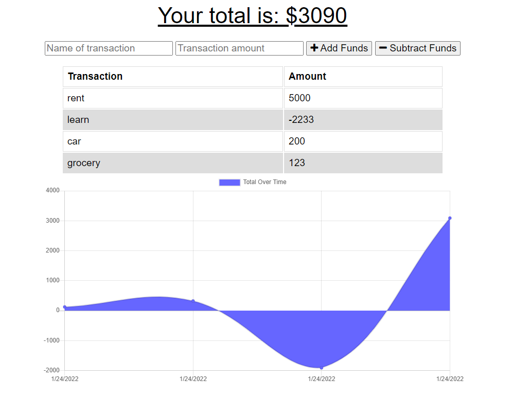

# PWA-budget-tracker

## Description

This is a Budget Tracker application that has been developed as a progressive web app that will allow for for offline access and functionality. Regardless of whether or not the user has an online connection, they will be able to utilize this app. The user can track their budget in real time by either depositing or debiting money based on transactions. If the user has an online connection this will constantly update the database as well as the UI. The greater functionality of this app is the ability to use this while offline. If no connection is available the user will still be able to track their expenses and see the visual graph, and the app will utilize the cache as well as the indexed database to store all transactions and as soon as the device comes online again it will then populate the database with those "pending" transactions. This app is able to be installed as a standalone app on a users desktop or laptop computer as well as mobile devices.

## Notes
This application uses the following Node.js packages:
- [express](https://expressjs.com/)
- [mongoose](https://www.npmjs.com/package/mongoose)
- [morgan](https://www.npmjs.com/package/morgan)
- [compression](https://www.npmjs.com/package/compression)

This application takes advantage of the following technologies:
- [progressive web app](https://web.dev/progressive-web-apps/)
- [web app manifest](https://web.dev/add-manifest/)
- [service worker](https://developer.mozilla.org/en-US/docs/Web/API/Service_Worker_API)
- [indexed db](https://developer.mozilla.org/en-US/docs/Web/API/IndexedDB_API)

## Instructions
This project is deployed on Heroku [https://pwa-budget-calculator.herokuapp.com/](https://pwa-budget-calculator.herokuapp.com/).

## Page Screenshots


### Application Functionalities

- The ability to enter deposits offline.
- The ability to enter expenses offline.
- Offline entries should be added to the tracker when the application is brought back online

### User Story

```text
AS AN avid traveler
I WANT to be able to track my withdrawals and deposits with or without a data/internet connection
SO THAT my account balance is accurate when I am traveling 
```

### Acceptance Criteria

```text
GIVEN a budget tracker without an internet connection
WHEN the user inputs an expense or deposit
THEN they will receive a notification that they have added an expense or deposit
WHEN the user reestablishes an internet connection
THEN the deposits or expenses added while they were offline are added to their transaction history and their totals are updated
```

## Contributing
Any and all collaboration is welcome so if you have any suggestions or thoughts for new features, please send me an email at [sehajmagan@gmail.com](mailto:sehajmagan@gmail.com)